 # Sales-Performance-Analysis
This project query data from AdventureWorksDW database Using SQL, connected to PowerBI using import mode to create data driven insight and visualizations.

## Introduction

This is an SQL with Power BI project on Sales performance analysis of AdventureWorksDW. It is done by analyzing data from different schemas on the AdventureWorksDW database. I analyzed data from dim_customers table, dim_date table, dim_product table, dim_territory sales and fact_internet sales table. I used SQL to query the data from the database, created views and imported to Power BI for further analysis. 

**_Disclaimer_** This is not a real company as we know that adventureworksDW database is compiled by Microsoft for learning purposes.

## Task
The goal of this analysis is to 
+ Determine the current market demand for products and how it varies by region/location
- Determine current sales performance and how it compares to past performance 
+ Discover target markets of product with the greatest impact on sales success.
- Recommend plans that aid in increasing sales, improve customer satisfaction and affinity.

## Action
The data used for this Project is queried from the AdventureWorksDW database 2019. I studied the Schema, Objects related to the Schema, data dictionary and found the right tables for the analysis.
You can find a link to get started with installation and restoration of the database to your local machine. [here]( https://www.youtube.com/watch?v=VpY0Q_kwtIw&feature=youtu.be)
#### Data Transformation
Several structured queries were written to get the right tables and then saved as views in the Database on SQL Management studio. The tables and views are:
+ Customers table
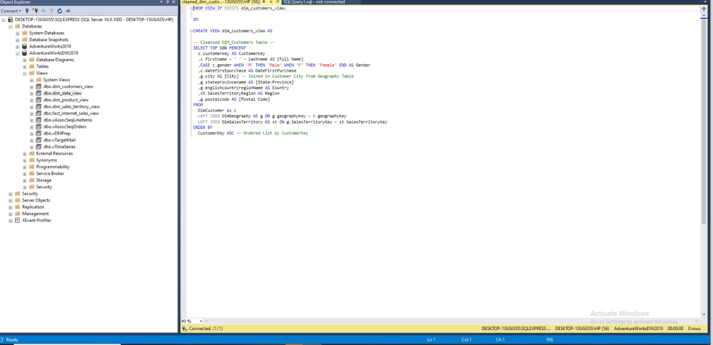
- Date table
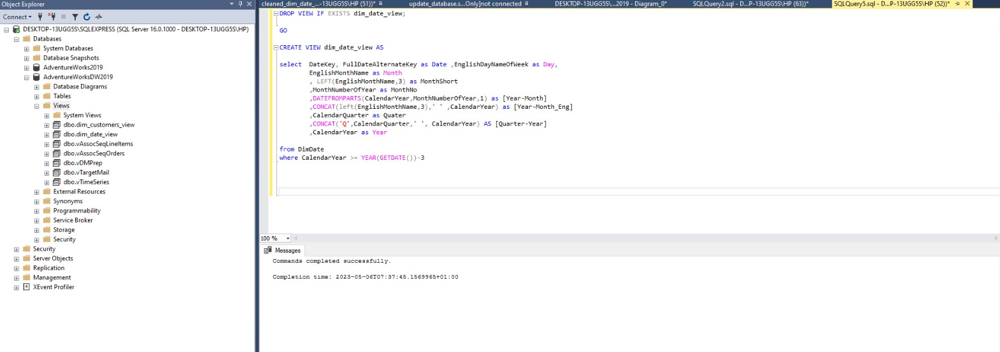
+ Sales table
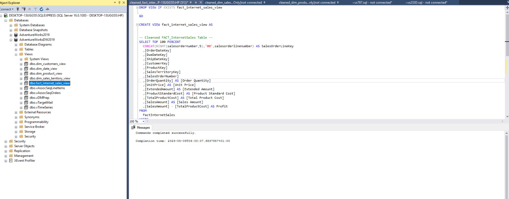
- Product table
 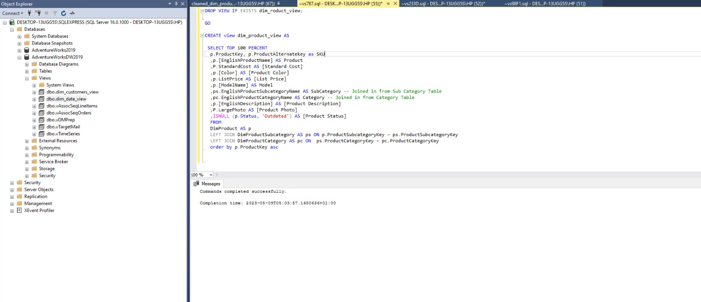
+ Connected SQL Server to PowerBI Desktop for analysis.

 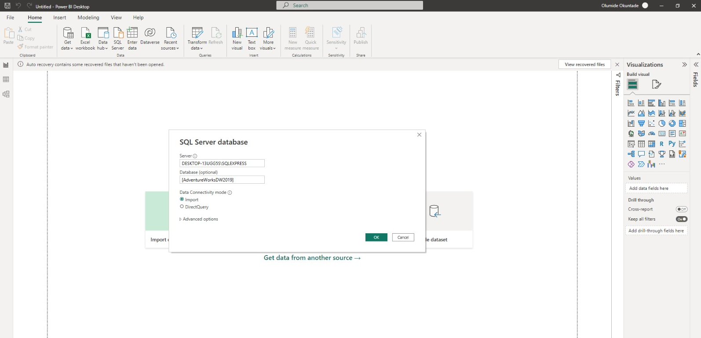
 
 - Selected the right table and transform to Power Query.
 
 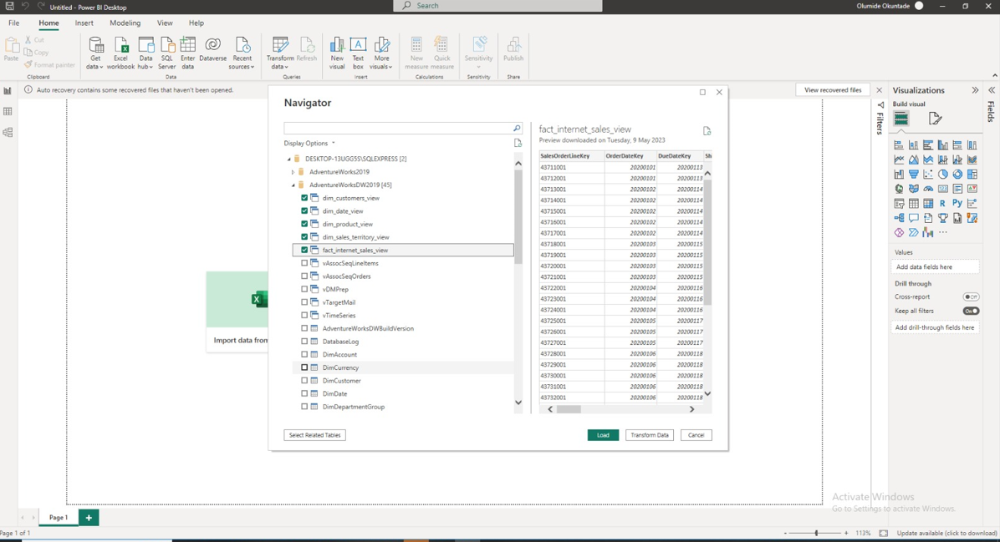
 
 
#### Data Modeling
Power BI automatically created relationships between tables using its intellisense, however, with my deep understanding of different models in power BI, I created a star schema that consist of one fact table and 5 dimention table.
  Automated Model                 |    Adjusted Model
:--------------------------------:| :----------------------------:
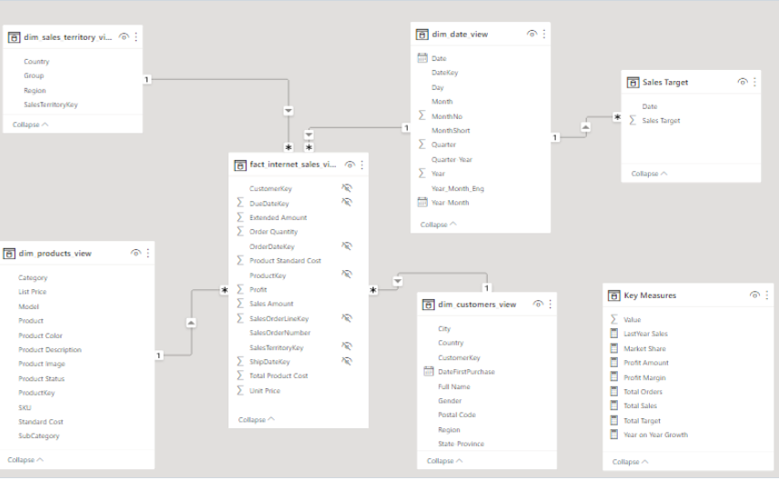   | 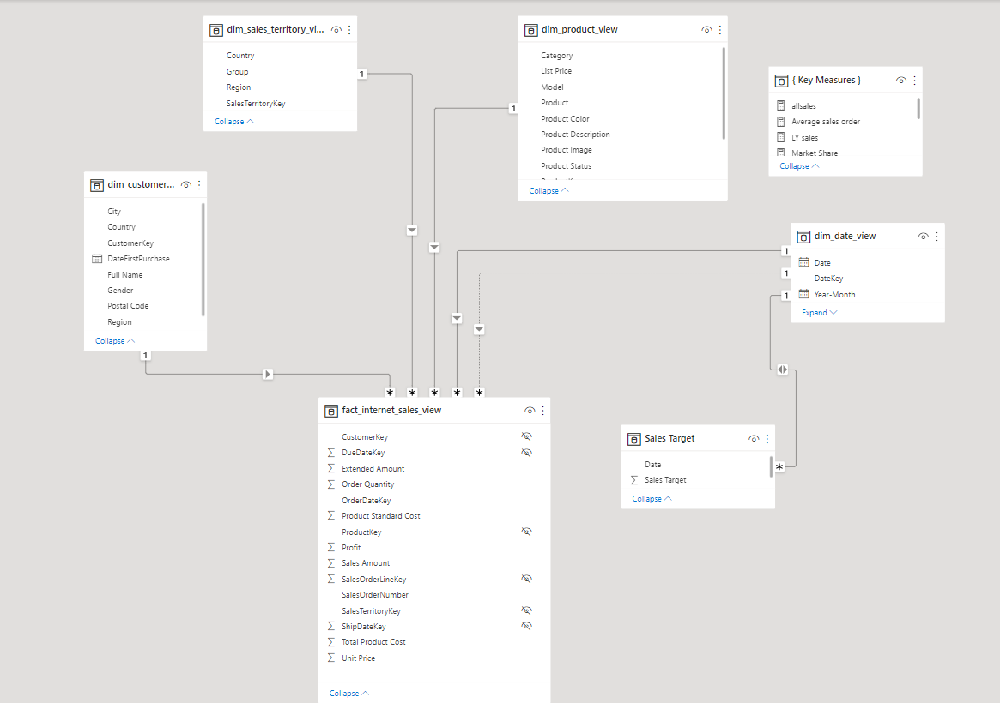

#### Data Analysis and Visualization
Creating calculated column for dates, time, and duration calculations
Creating key performance indicators (KPIs) and other business calculations like previous year sales, total sales,YoY growth  etc
Data Modelling,Measures,filters,tooltips,Page buttons, Page info,Key measures and charts
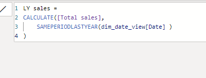 | 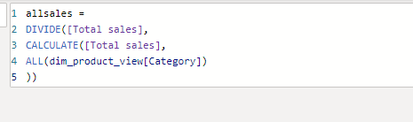 | 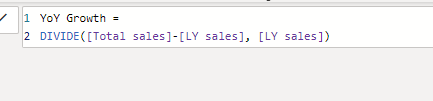
:----------------:|:------------------:| :------------------: |
## Result

A one page dashboard was created that answers the business questions, recommendations was also given to help improve business performance.
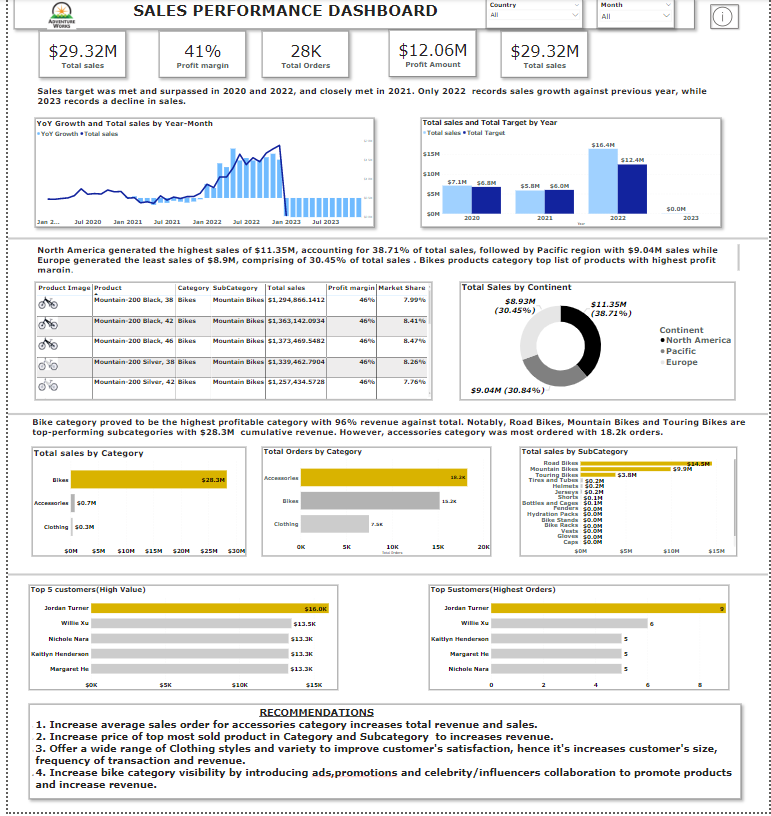 | 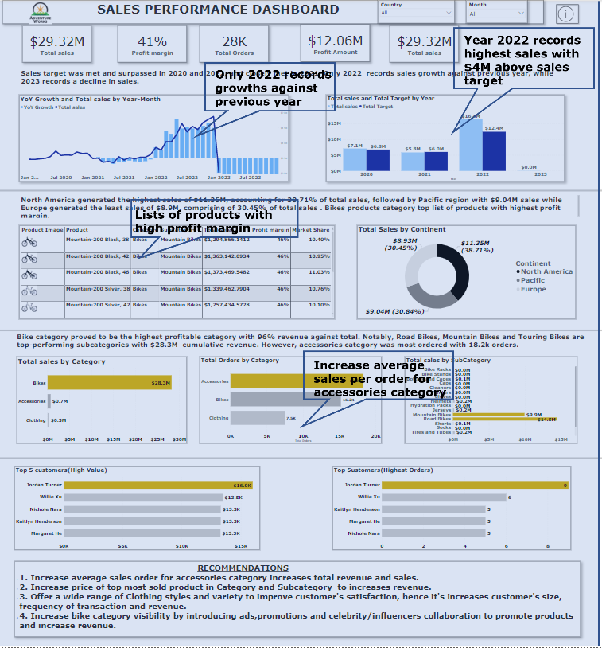
:-----------------------:| :-------------------------:
I also created an info page dashboard that highlight actionable point.

 Some of the insight derived from the dashboard includes 
+ year 2022 shows the highest sales with growth against previous year
+ Bikes category have the highest impact on sales than any other category
+ North America generated the highest sales within the regions 

